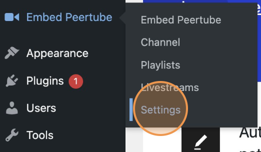
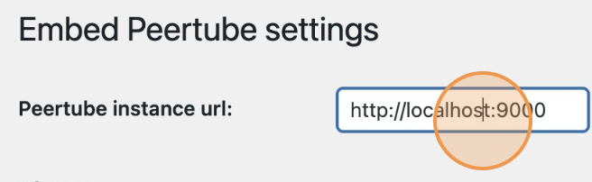
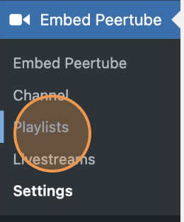
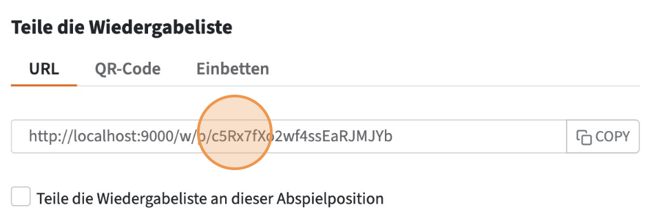
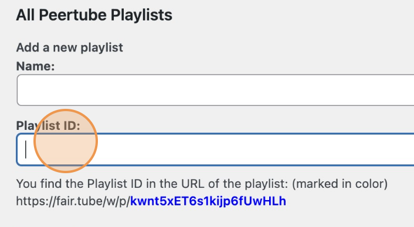
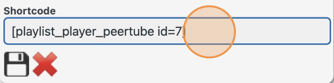

**Contributors:** fairkom / biowilli  
**Donate link:** [https://www.fairkom.eu/](https://www.fairkom.eu/)  
**Tags:** channel, playlist, peertube, video, grid, slider, list, peertube playlist, playlist peertube, peertube plugin, video playlist, peertube player, peertube integration, peertube api, player video, video integration, peertube embed, channels embed  
**Requires at least:** 3.5  
**Tested up to:** 6.1  
**Requires PHP:** 5.6  
**Stable tag:** 2.0.0  
**License:** GPLv3 or later  
**License URI:** [http://www.gnu.org/licenses/gpl-2.0.html](http://www.gnu.org/licenses/gpl-2.0.html)

# Embed Peertube Playlists and Livestreams

Embed Peertube playlists and livestreams on wordpress.

## Installation

1. Upload the plugin files to the `/wp-content/plugins/` directory, or install the plugin through the WordPress plugins screen directly.
2. Activate the plugin through the 'Plugins' screen in WordPress.

## How to use the plugin

3. Update the Peertube instance. Click "Settings".

   

4. Update the Instance.

   

5. Update the peertube plugin version. You can see that in peertube plugin page ('/admin/plugins/list-installed?pluginType=1')

6. Save the settings.

   

7. Go to the 'channels' or 'playlists' submenu.

   

8. Create a shortcode by saving the ID number from the playlist and create an element.

   

9. You can find the ID in the playlist, then share it. In the example, it is this number: c5Rx7fX02wf4ssEaRJMJYb.

   

10. Add the Playlist or Livestream ID and add it.

   

11. Copy the shortcode.

    

12. Go to the page where you wish to add the 'channel' or 'playlist'.
13. Add the shortcode.

## Deployment

Before deploying it, please ensure which version of the plugin is installed and change the API endpoints.

Zip it and upload it to WP.

zip -r v2.0.3_embed-peertube-wp_v1.8.4_metadata.zip ./embed-peertube-wp

### PS: it only works with public channels and playlists.
